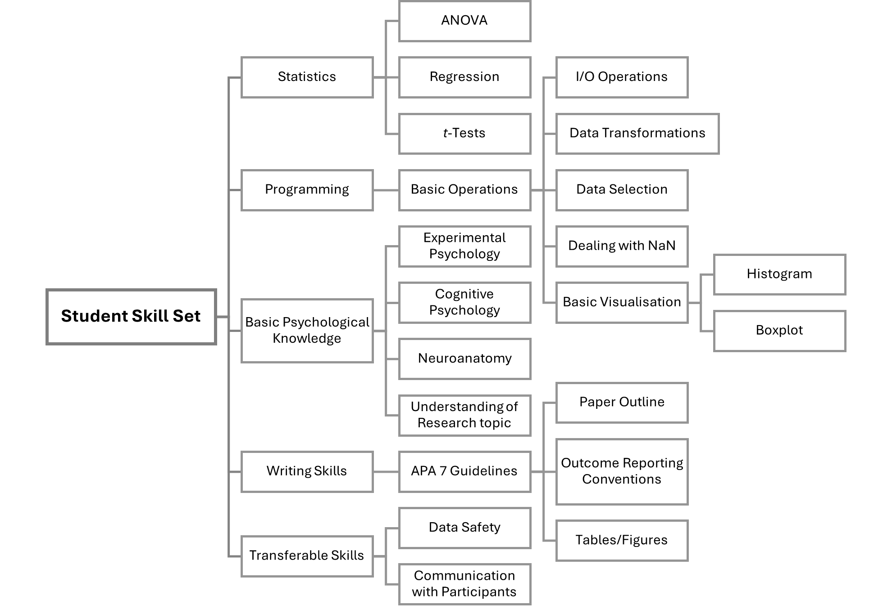

# Entry Programming Question for Master Students 
Our master’s projects are primarily coding-focused. To ensure a smooth experience, please only apply for projects in the lab if you can complete the following coding question without help of AI. If you encounter challenges while solving the questions, we recommend searching online and reviewing the relevant statistics courses offered by the department.

## Task Description

In the provided `data_demo.csv`, you will find a demo dataset from a psychological experiment. Please download the dataset and use your preferred programming language to solve the following question:
1. Set the path to where `data_demo.csv` is stored. 
2. Import the `data_demo.csv`, and inspect the data structure. How many subjects are there? What is the experimental design? 
3. Add a new column titled `correct_response`.  Set the value to 1 if the subject made a correct response, and 0 otherwise.
4. Remove all trials that contain artifacts from the dataset.
5. Compute the average reaction time and standard error for each condition (A and B). *Hint: Transform the data from long format to wide format to facilitate this calculation.*
6. Create a bar plot with error bars to visualize the averaged reaction times for conditions A and B.

## Skill Set
In addtion, please find below other skills that are not only beneficial but also expected for you to develop during your master’s project.

